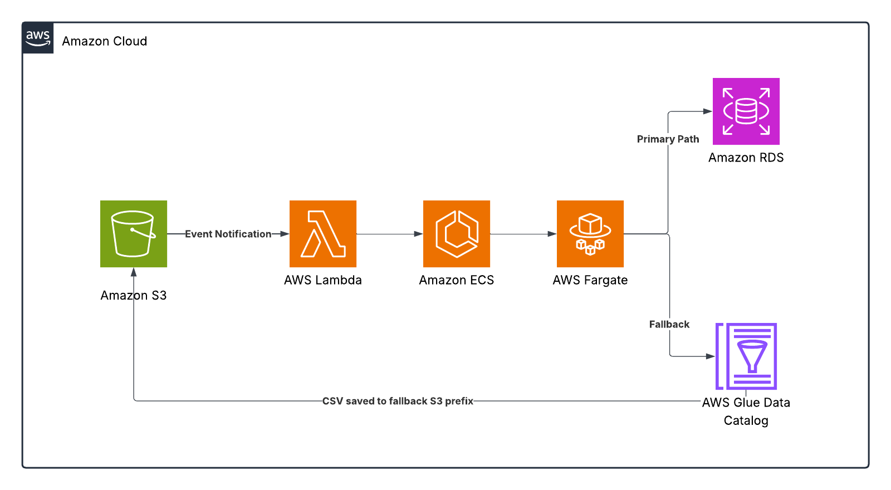

# Data Ingestion from S3 to RDS with Fallback to AWS Glue using Containerized Python Application

---

# Architecture Overview



# Policy & Scripts

## IAM Policy

### **ecsTaskRole**

```json
{
    "Version": "2012-10-17",
    "Statement": [
        {
            "Sid": "S3Access",
            "Effect": "Allow",
            "Action": [
                "s3:GetObject",
                "s3:PutObject",
                "s3:DeleteObject",
                "s3:ListBucket"
            ],
            "Resource": [
                "arn:aws:s3:::my-ingest-bucket-2025",
                "arn:aws:s3:::my-ingest-bucket-2025/*"
            ]
        },
        {
            "Sid": "SecretsAccess",
            "Effect": "Allow",
            "Action": [
                "secretsmanager:GetSecretValue",
                "secretsmanager:DescribeSecret"
            ],
            "Resource": "arn:aws:secretsmanager:REGION:ACCOUNT_ID:secret:my-rds-secret*"
        },
        {
            "Sid": "GlueAccess",
            "Effect": "Allow",
            "Action": [
                "glue:CreateDatabase",
                "glue:GetDatabase",
                "glue:CreateTable",
                "glue:GetTable",
                "glue:UpdateTable",
                "glue:BatchCreatePartition"
            ],
            "Resource": "*"
        },
        {
            "Sid": "CloudWatchLogsAccess",
            "Effect": "Allow",
            "Action": [
                "logs:CreateLogStream",
                "logs:PutLogEvents"
            ],
            "Resource": "*"
        }
    ]
}
```

### **ecsTaskExecutionRole**

```json
{
    "Version": "2012-10-17",
    "Statement": [
        {
            "Sid": "ECRAccess",
            "Effect": "Allow",
            "Action": [
                "ecr:GetAuthorizationToken",
                "ecr:BatchCheckLayerAvailability",
                "ecr:GetDownloadUrlForLayer",
                "ecr:BatchGetImage"
            ],
            "Resource": "*"
        },
        {
            "Sid": "CloudWatchLogsAccess",
            "Effect": "Allow",
            "Action": [
                "logs:CreateLogStream",
                "logs:PutLogEvents"
            ],
            "Resource": "*"
        }
    ]
}
```

### lambda-ingest-role

```json
{
    "Version": "2012-10-17",
    "Statement": [
        {
            "Sid": "AllowECSRunTask",
            "Effect": "Allow",
            "Action": [
                "ecs:RunTask",
                "ecs:DescribeTasks",
                "ecs:DescribeTaskDefinition"
            ],
            "Resource": [
                "arn:aws:ecs:REGION:ACCOUNT_ID:task-definition/ingest-cluster-task-2025:1"
            ]
        },
        {
            "Sid": "AllowPassBothRolesToECS",
            "Effect": "Allow",
            "Action": "iam:PassRole",
            "Resource": [
                "arn:aws:iam::ACCOUNT_ID:role/ecsTaskExecutionRole",
                "arn:aws:iam::ACCOUNT_ID:role/ecsTaskRole",
                "arn:aws:iam::ACCOUNT_ID:role/ingest-task-role-2025"
            ]
        },
        {
            "Sid": "AllowCloudWatchLogsForLambda",
            "Effect": "Allow",
            "Action": [
                "logs:CreateLogGroup",
                "logs:CreateLogStream",
                "logs:PutLogEvents"
            ],
            "Resource": "*"
        }
    ]
}

```

## Scripts

### requirements.txt

```
boto3>=1.26
pandas>=1.4
sqlalchemy>=1.4
pymysql>=1.0
python-dotenv>=0.21
```

### main.py

```python
#!/usr/bin/env python3
import os, io, logging, sys, json
from datetime import datetime, timezone

import boto3
import pandas as pd
from botocore.exceptions import ClientError
import sqlalchemy
from sqlalchemy.exc import SQLAlchemyError

logging.basicConfig(level=os.getenv("LOG_LEVEL", "INFO"))
logger = logging.getLogger("ingest")

# AWS Config
AWS_REGION = os.getenv("AWS_REGION", "us-east-1")
session = boto3.Session(region_name=AWS_REGION)
s3 = session.client("s3")
glue = session.client("glue")

# S3 Settings
S3_BUCKET = os.getenv("S3_BUCKET")
CSV_KEY = os.getenv("CSV_KEY")
CSV_PREFIX = os.getenv("CSV_PREFIX")
CSV_MODE = os.getenv("CSV_MODE", "all")  # latest or all
PROCESSED_PREFIX = os.getenv("PROCESSED_PREFIX", "processed/")
FAILED_PREFIX = os.getenv("FAILED_PREFIX", "failed/")

# Glue Settings
GLUE_DB = os.getenv("GLUE_DATABASE", "ingest_fallback_db")
GLUE_TABLE = os.getenv("GLUE_TABLE", "ingest_fallback_table")
GLUE_FALLBACK_PREFIX = os.getenv("GLUE_FALLBACK_PREFIX", "fallback/")

# RDS (optional local testing)
RDS_HOST = os.getenv("RDS_HOST")
RDS_PORT = int(os.getenv("RDS_PORT", "3306"))
RDS_USER = os.getenv("RDS_USER")
RDS_PASSWORD = os.getenv("RDS_PASSWORD")
RDS_DB = os.getenv("RDS_DB")
RDS_TABLE = os.getenv("RDS_TABLE")
RDS_SECRET_NAME = os.getenv("RDS_SECRET_NAME")

def get_rds_credentials():
    # Use .env vars for local testing
    if all([RDS_USER, RDS_PASSWORD, RDS_HOST, RDS_PORT, RDS_DB]):
        return {
            "host": RDS_HOST,
            "port": RDS_PORT,
            "user": RDS_USER,
            "password": RDS_PASSWORD,
            "database": RDS_DB,
        }

    if not RDS_SECRET_NAME:
        raise ValueError("RDS_SECRET_NAME not set and no inline RDS credentials found")

    secrets_client = session.client("secretsmanager")
    try:
        response = secrets_client.get_secret_value(SecretId=RDS_SECRET_NAME)
        secret = json.loads(response["SecretString"])
        return {
            "host": secret["host"],
            "port": int(secret["port"]),
            "user": secret["username"],
            "password": secret["password"],
            "database": secret["dbname"],
        }
    except Exception as e:
        logger.exception("Failed to load RDS credentials from Secrets Manager")
        raise e

def build_engine():
    creds = get_rds_credentials()
    conn = f"mysql+pymysql://{creds['user']}:{creds['password']}@{creds['host']}:{creds['port']}/{creds['database']}"
    return sqlalchemy.create_engine(conn, pool_pre_ping=True)

def list_csv_objects(bucket, prefix):
    kwargs = {"Bucket": bucket, "Prefix": prefix}
    results = []
    while True:
        resp = s3.list_objects_v2(**kwargs)
        for o in resp.get("Contents", []):
            k = o["Key"]
            if k.lower().endswith(".csv"):
                results.append({
                    "Key": k,
                    "LastModified": o["LastModified"],
                    "Size": o["Size"]
                })
        if not resp.get("IsTruncated"):
            break
        kwargs["ContinuationToken"] = resp.get("NextContinuationToken")
    return results

def download_df(bucket, key):
    logger.info("Downloading s3://%s/%s", bucket, key)
    resp = s3.get_object(Bucket=bucket, Key=key)
    return pd.read_csv(io.BytesIO(resp["Body"].read()))

def move_object(bucket, src_key, dest_prefix):
    base = os.path.basename(src_key)
    ts = datetime.now(timezone.utc).strftime("%Y%m%dT%H%M%SZ")
    dest_key = f"{dest_prefix.rstrip('/')}/{ts}_{base}"
    s3.copy_object(Bucket=bucket, CopySource={'Bucket': bucket, 'Key': src_key}, Key=dest_key)
    s3.delete_object(Bucket=bucket, Key=src_key)
    return dest_key

def push_to_rds(df):
    engine = build_engine()
    df.to_sql(RDS_TABLE, con=engine, index=False, if_exists="append", method="multi")
    logger.info("Pushed to RDS table %s", RDS_TABLE)

def infer_glue_columns(df):
    cols = []
    for name, dtype in df.dtypes.items():
        t = str(dtype)
        if "int" in t: g = "bigint"
        elif "float" in t: g = "double"
        elif "bool" in t: g = "boolean"
        elif "datetime" in t: g = "timestamp"
        else: g = "string"
        cols.append({"Name": name, "Type": g})
    return cols

def register_glue(df, bucket, orig_key):
    base = os.path.basename(orig_key)
    ts = datetime.now(timezone.utc).strftime("%Y%m%dT%H%M%SZ")
    target_prefix = GLUE_FALLBACK_PREFIX.rstrip('/') + '/'
    new_key = f"{target_prefix}{ts}_{base}"
    csv_buf = df.to_csv(index=False).encode("utf-8")

    s3.put_object(Bucket=bucket, Key=new_key, Body=csv_buf)
    s3_location = f"s3://{bucket}/{new_key}"

    # Ensure database exists
    try:
        glue.get_database(Name=GLUE_DB)
    except glue.exceptions.EntityNotFoundException:
        glue.create_database(DatabaseInput={"Name": GLUE_DB})

    cols = infer_glue_columns(df)
    table_input = {
        "Name": GLUE_TABLE,
        "StorageDescriptor": {
            "Columns": cols,
            "Location": s3_location,
            "InputFormat": "org.apache.hadoop.mapred.TextInputFormat",
            "OutputFormat": "org.apache.hadoop.hive.ql.io.HiveIgnoreKeyTextOutputFormat",
            "SerdeInfo": {
                "SerializationLibrary": "org.apache.hadoop.hive.serde2.lazy.LazySimpleSerDe",
                "Parameters": {
                    "field.delim": ",",
                    "skip.header.line.count": "1"
                }
            }
        },
        "TableType": "EXTERNAL_TABLE",
        "Parameters": {"classification": "csv"}
    }

    try:
        glue.get_table(DatabaseName=GLUE_DB, Name=GLUE_TABLE)
        glue.update_table(DatabaseName=GLUE_DB, TableInput=table_input)
        logger.info("Glue table updated: %s.%s -> %s", GLUE_DB, GLUE_TABLE, s3_location)
    except glue.exceptions.EntityNotFoundException:
        glue.create_table(DatabaseName=GLUE_DB, TableInput=table_input)
        logger.info("Glue table created: %s.%s -> %s", GLUE_DB, GLUE_TABLE, s3_location)

def process_key(key):
    try:
        df = download_df(S3_BUCKET, key)
    except Exception as e:
        logger.exception("Download failed: %s", e)
        return False

    # Try RDS
    try:
        push_to_rds(df)
        move_object(S3_BUCKET, key, PROCESSED_PREFIX)
        logger.info("Success: moved to processed")
        return True
    except Exception as e:
        logger.exception("RDS write failed, falling back: %s", e)

    # Fallback to Glue
    try:
        register_glue(df, S3_BUCKET, key)
        move_object(S3_BUCKET, key, FAILED_PREFIX)
        logger.info("Fallback succeeded: moved to failed")
        return True
    except Exception as e:
        logger.exception("Fallback failed: %s", e)
        return False

def main():
    if not S3_BUCKET:
        logger.error("S3_BUCKET required")
        sys.exit(2)

    keys = []
    if CSV_KEY:
        keys = [CSV_KEY]
    elif CSV_PREFIX:
        objs = list_csv_objects(S3_BUCKET, CSV_PREFIX)
        if not objs:
            logger.info("No CSV files found")
            return
        if CSV_MODE == "latest":
            keys = [sorted(objs, key=lambda x: x["LastModified"], reverse=True)[0]["Key"]]
        else:
            keys = [o["Key"] for o in sorted(objs, key=lambda x: x["LastModified"])]
    else:
        logger.error("No CSV_KEY or CSV_PREFIX specified")
        return

    logger.info("Processing keys: %s", keys)
    for k in keys:
        process_key(k)

if __name__ == "__main__":
    main()
```

### Dockerfile

```docker
FROM python:3.9-slim
WORKDIR /app
COPY requirements.txt .
RUN pip install --no-cache-dir -r requirements.txt
COPY main.py .
CMD ["python","main.py"]
```

### .env

```
AWS_REGION=us-east-1
AWS_ACCESS_KEY_ID= # local testing
AWS_SECRET_ACCESS_KEY= # local testing
S3_BUCKET=my-ingest-bucket-2025
CSV_KEY=uploads/test.csv
RDS_SECRET_NAME=my-rds-secret
RDS_TABLE=mytable
```

### lambda_function.py

```python
import json
import boto3
import os

ecs = boto3.client('ecs')

def lambda_handler(event, context):
    print("Lambda triggered. Event:", json.dumps(event, default=str))

    try:
        response = ecs.run_task(
            cluster=os.environ['ECS_CLUSTER'],
            launchType='FARGATE',
            taskDefinition=os.environ['TASK_DEFINITION'],
            count=1,
            platformVersion='LATEST',
            networkConfiguration={
                'awsvpcConfiguration': {
                    'subnets': os.environ['SUBNETS'].split(','),
                    'securityGroups': os.environ['SECURITY_GROUPS'].split(','),
                    'assignPublicIp': 'ENABLED'
                }
            },
            overrides={
                'containerOverrides': [
                    {
                        'name': os.environ['CONTAINER_NAME'],
                        'environment': [
                            {
                                'name': 'MY_ENV_VAR',
                                'value': 'example_value'
                            }
                        ]
                    }
                ]
            }
        )

        print("ECS run_task response:", json.dumps(response, indent=2, default=str))

        failures = response.get("failures", [])
        if failures:
            print("ECS run_task FAILED:", json.dumps(failures, indent=2, default=str))
            return {
                'statusCode': 500,
                'body': json.dumps({"message": "ECS task failed to start", "failures": failures}, default=str)
            }

        return {
            'statusCode': 200,
            'body': json.dumps("ECS task started successfully"),
            'response': response
        }

    except Exception as e:
        print("Exception while running ECS task:", str(e))
        return {
            'statusCode': 500,
            'body': json.dumps(f"Error: {str(e)}")
        }

```

# Environment Variable (lambda_function.py)

| **Key** | **Value** | Description |
| --- | --- | --- |
| `CONTAINER_NAME` | ingest-container | Name of the container in the task definition (must match `name` in ECS JSON) |
| `ECS_CLUSTER` | ingest-cluster | ECS cluster name |
| `SECURITY_GROUPS` | sg-071f1da275f59579b | Comma-separated list of security group IDs for the task |
| `SUBNETS` | subnet-001dea54df8db8d8a, subnet-04ecbe9d99b9aebd4 | Comma-separated list of subnet IDs in your VPC (for Fargate) |
| `TASK_DEFINITION` | ingest-cluster-task-2025:1 | ECS task definition (name:revision or full ARN) |

# AWS Secret Creation CLI Command

```bash
aws secretsmanager create-secret \
  --name my-rds-secret \
  --secret-string '{
    "username": "root",
    "password": "password",
    "host": "database-1.fcuiewas.us-east-1.rds.amazonaws.com",
    "port": 3306,
    "dbname": "mydatabase"
  }'
```

# Data Flow Overview

The **architecture** shown in the diagram and described in the scripts is designed to handle data ingestion from Amazon S3 to Amazon RDS, with a fallback mechanism to AWS Glue in case the primary path fails.

- **Amazon S3 Event Notification**:
    
    When a new CSV file is uploaded to a specific S3 bucket, an event notification triggers a Lambda function.
    
- **AWS Lambda Function**:
    
    The Lambda function is responsible for initiating an ECS task. This function listens to events from S3 and triggers the containerized Python application hosted on ECS. Lambda serves as a lightweight orchestration point to handle the event from S3.
    
- **Amazon ECS with Fargate**:
    
    The ECS service, running on Fargate, is tasked with processing the CSV file from S3. The ECS task can scale based on the data processing requirements and automatically handle the containerized Python application.
    
- **Primary Path - Amazon RDS**:
    
    The Python application attempts to ingest the CSV data into an RDS instance. It uses SQLAlchemy to connect to the RDS MySQL database and insert the data into the specified table. If successful, the file is moved to a processed folder in S3.
    
- **Fallback Path - AWS Glue**:
    
    If RDS ingestion fails, the data is sent to AWS Glue, where it is registered as an external table. Glue allows the data to be cataloged and queried with other AWS analytics services like Amazon Athena or Redshift Spectrum. The file is then moved to a failed folder in S3.
    

---

## Using EC2 Instead of ECS

While the current solution uses Amazon ECS with Fargate to run the containerized Python application, you could alternatively use an EC2 instance to run the Python application. In this case:

- **EC2 Role Permissions**: The EC2 instance would need the necessary IAM permissions to interact with S3, RDS, Glue, and CloudWatch. These permissions are typically granted via an IAM role attached to the EC2 instance.
- **Environment Variables**: You would set environment variables (such as AWS access key, secret key, and region) on the EC2 instance to authenticate with AWS services.
- **Challenge**: EC2 may be more resource-intensive and require manual scaling, while ECS provides automatic scaling based on demand.
